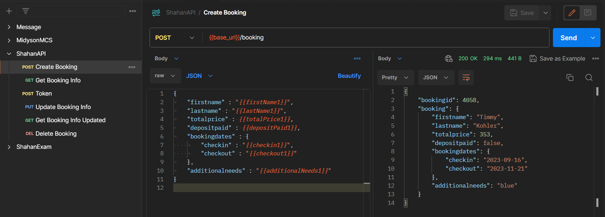
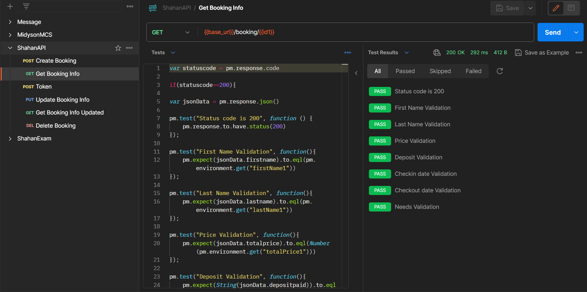
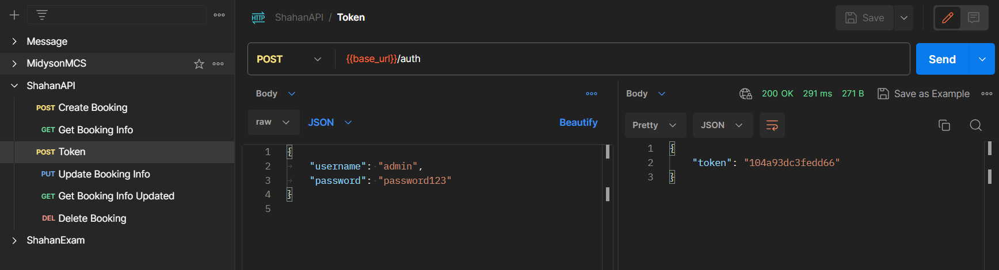
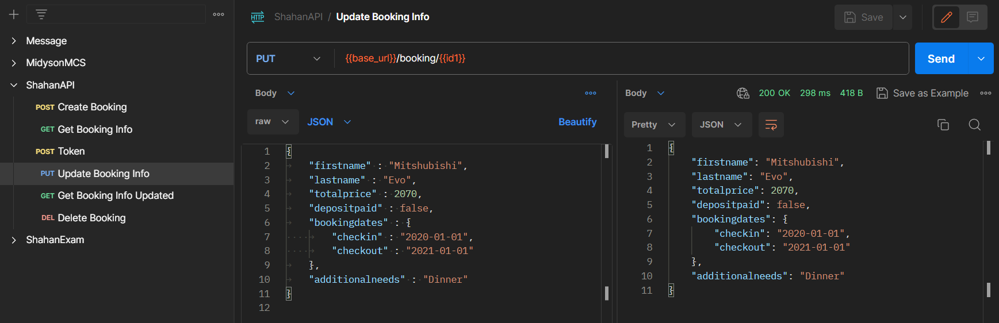
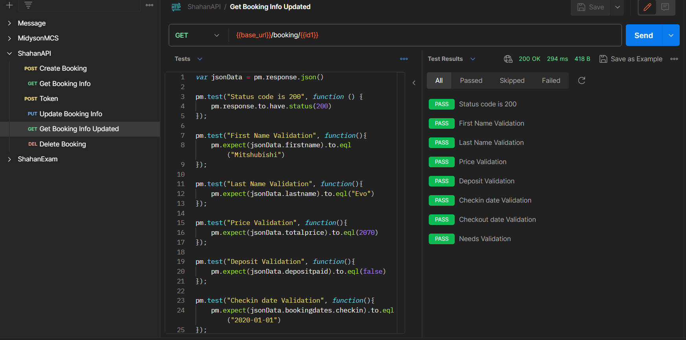
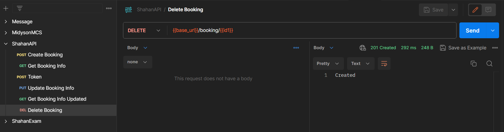

# API testing (Booking API test)

Hello and welcome! This GitHub repository contains a collection of tests for a Booking API(https://restful-booker.herokuapp.com), organized and tested to demonstrate the functionality of the API endpoints using Postman API testing tool. The tests cover various HTTP methods i.e. POST, GET, DELETE, and PUT, offering a complete assessment of the functionalties of API testing and calling.

## Description of API calls and tests

- Create Booking: POST method http request is used here in order to create booking data and dynamic data is used using Pre-request script. These dynamic data are saved in environment variables as well for future validation. From response body, bookingid is fetched and stored as environment variable id1.

  
- Get Booking Info: GET method http request is used here to fetch Booking data that was created before. A number of API testings are peformed for Status code validation, as well as validation of all data that is recieved in response body with stored environment variables.

  
- Token: POST method http request is used here to entry username and password data for receiving token. This token will be used as permission for updating existing data as well as deleting stored data.

  
- Update Booking Info: PUT method http request is used here to override the existing Booking data with new data. For update access permission, token is entered in the header. Here static data is given as input for variation.

  
- Get Booking Info Updated: GET method http request is used here to fetch new Booking data. Here status code validation as well as data validation is made for the updated Booking info.

  
- Delete Booking: DELETE method http request is used here to delete the data associated with id1. For delete access permission, token is entered in the header.

## Newman report generation

At first, API collection as well as API environment is exported in a folder for the purpose of Newman report generation. Using command-line interface inside the exported directory folder, the following command-line is used for Newman report generation:

newman run ShahanAPI.postman_collection.json -e ShahanEnv.postman_environment.json -r cli,htmlextra 

## Usage

 - Clone the repository to your local environment.
 - Import the provided Postman collection to access the pre-configured test suite.
 - Run the test suite using Postman to execute the tests against the Booking API.
 - View the generated test report to gain insights into the API's behavior and performance.
